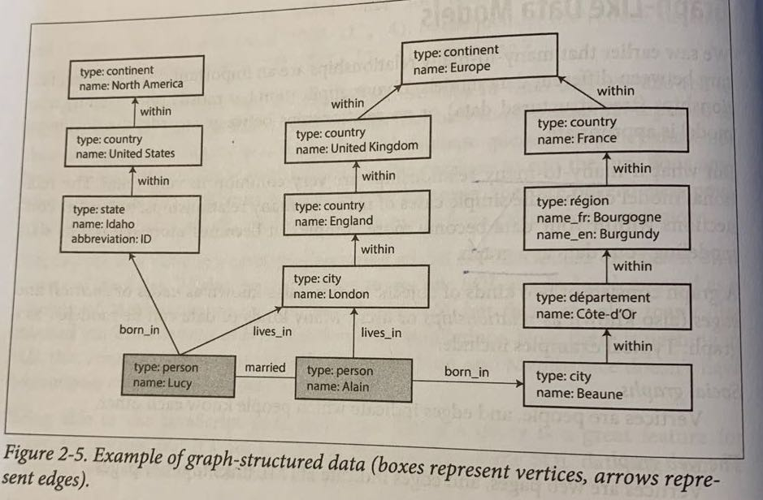

# 第2章 数据模型与查询语言

数据库按 Data Model 可以分为下面几类

- Relational Model 关系型数据模型
- Document Model 文档数据模型
- Graph Model 图数据模型

关系型数据库（RDBMS）是我们最熟悉、最通用的数据库系统了。大家都很熟悉，这里就不多说了。

2010 年代，NoSQL 开始流行，它流行的原因是

- NoSQL 相比 RDBMS 有更强的拓展性（scalibility）
- 开源
- 特殊的查询语句，能解决 SQL 语句的痛点
- 更加动态的 schema

现在大多数的编程语言是面向对象语言，但是 RDBMS 的数据并不是以对象的形式存储的。磁盘上的数据要通过一些转换才能变成内存里的数据。例如，对象可能包含不定长的数组属性（一对多关系），这样的属性无法存储在 RDBMS 中，但是可以保存在 NoSQL 数据库中。因此 NoSQL 数据库提供了更好的局部性（locality）

但是 NoSQL 也有一个痛点：在处理多对一和多对多关系上会更加复杂一些。因为在处理这样的关系是，需要在多个记录中保存重复值，这样就违反了数据库的第一范式。举个例子，在一个文档数据库中保存用户信息，结构如下

```json
{
	"name": "John Smith",
	"state": "California",
	"hobbies": ["coding", "drawing"]
}

{
	"name": "Mike Pence",
	"state": "California",
	"bobbies": ["coding", "drawing"]
}
```

在上面的两个记录中都有 `state` 属性，保存了重复值 `California` 。而在 RDBMS 中，这样的属性通过外键来关联到同一条记录。

下面是第一范式的定义

- 记录有唯一标识符。在上面的例子中，如果两个记录的 `name` 都是 `John Smith` 的话，我们就无法区分哪个记录对应于哪个用户了。因此想要遵守第一范式，必须要提供一个主键
- 记录中的每个结构只能有单一值。在上面的例子中， `hobbies` 属性是一个数组，保存了两个值

违反第一范式后，在修改值的时候通常很困难。比如上面的 `hobbies` 属性，如果说有些人将 `coding` 写成了 `code` 、 `programing` 或者 `Programing` ，这几个词都表示同一个意思（编程）。当你想要把它们统一用一个词时（比如说用 `coding` ），那么你就需要遍历所有的记录、再遍历所有的 `hobbies` 元素，找到对应的元素，然后更新记录。这是 N^2 复杂度的问题

文档数据库也可以使用 document reference 来处理多对一和多对多属性，但是这样就退化成了关系型数据库了

------

## 关系型数据库 vs 文档数据库

关系型数据库和文档数据库对比，关系型数据库有下面的优点

- 更好的关联操作（join）
- 更好的多对一和多对多关系

文档数据库的优点是

- 动态 schema
- 更快的查询速度（locality）
- 数据模型与应用程序的数据模型更接近

究竟用哪个数据库，取决于你的应用程序的需求。如果你的应用程序的数据之间有更多的关联，那就用关系型数据库；如果你的应用程序中没有多对一和多对多关系，那么就可以用文档数据库。但有一个更重要的问题需要考虑：即使你现在的应用程序不需要多对一和多对多关系，你也很难能保证未来不会有新的需求导致你还是需要这样的关系

### schema

关系型数据库和文档数据库的另一个不同点在于 schema 是否可以动态修改。关系型数据库会在插入数据之前，定义好一个 schema；而文档数据库则没有 schema，应用程序可以自由地保存任意结构的数据。

关系型数据库的这个特点被称为 schema-on-write，即在保存数据时，数据必须满足 schema 的定义；而文档数据库的这个特点被称为 schema-on-read，即应用程序在读取数据后，会按照一个特定的 schema 去使用数据。这算是一种隐性的 schema

在使用关系型数据库时，读取了一条记录后，你能十分确定这条记录有多少属性、每个属性的类型、属性是否可能为空等。但是在使用文档数据库后，你不能做出这些假设，因此很容易犯错。

当你要修改关系型数据库的 schema 时，情况会变得比较复杂。比如说你要增加一列属性，关系型数据库需要找到所有的记录并做出修改，这可能需要耗费大量的时间。不过你也可以让新增加的字段的值为 `NULL` ，然后重写应用程序代码，在使用到一条记录的这个字段时，才对字段值做出修改。MySQL 5.7 之后，在修改 schema 的时候，数据库并不会停止服务。

### 局部性

文档数据库会把一个文档的数据保存在一段连续的磁盘空间上，一次读取会把文档的全部内容读出来，因此数据局部性会比关系型数据库要好。但是如果你读取了文档的全部内容，却只使用了其中的一部分数据，就会有些浪费了

### 关系型数据库和文档数据库越来越像了

现在关系型数据库也支持 JSON 属性了（PostgreSQL 9.3，MySQL 5.7），并可以对 JSON 中的字段做索引、查询、修改

文档数据库也开始支持 JOIN 操作了（RethinkDB 和 MongoDB）

------

## Query Languages for Data

数据库的查询语言，可以分为声明式语言（declarative language）和命令式语言（imperative language）

声明式语言告诉数据库，我想要什么样的数据；而命令式语言告诉数据库，怎么查询到我想要的数据

因为下面这些原因，声明式语言是更好的一种查询方式

- 这个方式给了数据库去优化查询效率的空间。数据库可以根据查询可能用到的索引、排序等属性自行决定查询计划，这个优化的过程与应用程序代码完全结偶
- 命令式会隐式引入一些不必要的约束。比如，命令式语言可能会在无意中决定了数据的排序，导致数据库不能按照更高效的方式查询
- 声明式语言更易于并发执行

### MapReduce 执行

什么是 MapReduce 就不说了。MongoDB 中用户可以使用 JS 编写 MapReduce 过程，从而并发地执行一些计算

MapReduce 是一个声明式和命令式相结合的过程

------

## 图数据模型

对于多对多数据模型，文档数据库支持得很不好，关系型数据库支持得一般，而图数据库（Graph Model）支持得非常好

图数据模型中，有两种对象：节点（vertices）和边（edges）。节点可以认为是数据，而边则是数据之间的关系

图数据模型最棒的一个特点是，数据库中节点的类型可以完全不同。这也让图数据模型能够轻易地扩展新的数据结构

下面是一个图数据库实例，它表示了两个人 Lucy 和 Alain 之间的关系，以及他们的出生地和居住地



Neo4j 是一个使用 Java 编写的图数据库，它的查询语言是 Cypher

### Triple-Store 模型

triple-store 模型可以用来表示图数据模型。它使用了 three-part statement 的方式声明一个关系 `(subject, predicate, object)` 。例如 `(Jim, likes, bananas)` 表示 Jim 喜欢香蕉，这样就可以在 Jim 和香蕉之间画一个前者指向后者的箭头

### Datalog 模型

Datalog 模型和 triple-store 模型非常像，只不过形式是 `predicate(subject, object)`

------

## 总结

这章讲了各种不同的数据模型，你需要根据自己的应用程序需求，选择最适合的模型

一开始，数据模型都是树形结构。但是它不适合表示多对多关系，这时出现了关系型数据库。关系型数据库在面向对象语言中有些不趁手，因此又出现了 NoSQL 数据库：

- 文档数据库。文档数据库违反第一范式，与面向对象语言非常契合，但是很多数据库也提供将其规范化的方法
- 图数据库。特别适合处理多对多关系，非常灵活，容易扩展

现在关系型数据库、文档数据库、图数据库都很流行