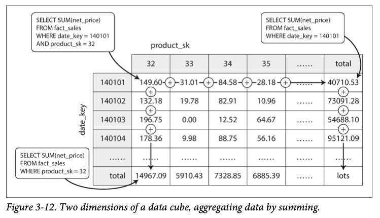

# 第3章 Storage and Retrieval

了解数据库底层的数据结构，可以帮助我们选择一个适合应用程序需求的数据库

## 数据库的数据结构

下面是一个非常简单的键值对数据库

```bash
#!/bin/bash

db_set() {
	echo "$1,$2" >> database
}

db_get() {
	grep "^$1," database | sed -e "s/^$1,//" | tail -n 1
}
```

这个数据库提供 `db_set` 和 `db_get` 两个接口，分别保存和查询一个键值对。 `db_set` 非常的高效，因为它向文件的末尾追加一个记录； `db_get` 则从文件末尾向前查询键值对记录。前者的复杂度是 O(1)，后者的复杂度是 O(n)

为了提高数据库的查询效率，我们需要另外一种数据结构：索引（index）。索引是数据库的附加的元数据，能够帮助我们定位数据位置。因为是附加的数据，所以移除索引并不会影响实际的数据。但是，引入索引会影响数据库的写入效率。因此数据库的管理员需要权衡写入效率和查询效率，选择一个合适的索引

### 哈希索引

哈希索引的实现方式是在内存中维护一个哈希字典，键就是键值对数据库中的键，而值是数据记录在文件中的偏移量。这样在查询一个键时，我们从字典中查询到键的偏移量，然后直接到文件中对应的位置读取记录

Bitcask 使用哈希索引

哈希索引的一个要求是，键不能太多，因为所有的键都需要保存在内存中

如果操作系统把文件缓存在内存中，那么读取文件指定位置的操作，都不需要的磁盘 IO

哈希索引适合那些经常会频繁更新键的值的应用

在频繁更新值后，数据文件会变得越来越大。当到达一定的大小时，我们可以把文件分隔成多个小文件（segment）。对于每个 segment，我们也能压缩文件（compaction），即对于一个数据记录，只保存最后一次出现的记录，之前出现的记录都删除。多个 segment，也可以使用同样的原理去合并（merge）

压缩和合并操作可以在后台线程中进行，这时数据库依然可以对外提供服务。当压缩和合并完成后，将老的文件删除，使用新的文件提供服务

每一个 segment 都会在内存中有一个哈希字典。当需要查询一个键时，从最新的哈希字典中查找键，如果字典中没有，则从前一个哈希字典中查找键，以此类推，直到最老的一个字典，如果还是没有，则说明键值对并不存在

实现哈希索引还需要注意下面几点

- 数据文件格式：上面的例子使用了 CSV，更好的方法是使用二进制格式。先编码字符串的大小，然后跟着实际的字符串
- 删除记录：要删除一个记录的话，需要在文件中放一个特殊的标记，表示一个键已经被删除了。这种标记被称为 tombstone
- 崩溃恢复：崩溃后内存中的哈希索引会丢失，所以重启后需要重建索引。如果数据文件很大的话，重建会耗费大量的时间。Bitcask 会把索引本身也保存在磁盘上，以加快重启速度
- Partially written records：如果在写记录时程序崩溃，那么可能只写了记录的一部分到磁盘上，这时候数据就变成了 corrupted 状态。为了检查 corrupted 文件，我们可以保存文件的 checksum，并忽略已经 corrupted 的文件
- 并发控制：同一时刻，只能有一个线程执行写操作，但是可以有多个线程读取数据

哈希索引的优点

- 高性能：向文件追加内容很高效
- 并发和数据 corrupted 比较容易。不会出现一个记录包含一半老的数据、一半新的数据的情况
- segment 可以不停合并

哈希索引的缺点

- 键不能太多，否则哈希字典就不能保存在内存中了。当然也可以在磁盘上维护一个哈希字典，但是比较复杂
- 不太容易实现范围查询，因为相似的键不会保存在连续的地方

### SSTable 和 LSM 树

对于上面的数据文件，如果我们要求键值对按照键排序，就得到了 SSTable（Sort String Table），它有下面这些好处

1. 合并文件更简单。可以使用合并排序算法合并两个文件，分别读取两个文件的第一个键值对，比较键的大小，将较小的键拷贝到输出文件中。如果键相等，拷贝较新的键
2. 查询时，不需要在内存中维护全内容的索引字典。我们只需要维护稀疏内存索引（sparse in-memory index），然后将查询的键与稀疏索引比较，你就能直到键是在文件的哪个部分了
3. 可以压缩键值对，然后写入数据文件？（这里没看懂）

那要如何构造一个 SSTable 呢？下面是步骤

- 当要写入一个键值对时，将键值对写入到内存中的平衡树（红黑树，AVL 树等），这个数据结构被称为 memtable
- 当 memtable 增大到特定大小时（几 MB），将它写入到磁盘上的 SSTable 上。在内存中重新实例化一个 memtable
- 当要查找一个键值对时，先从内存中的 memtable 中查找，然后是磁盘上最新的 SSTable 等
- 将磁盘上的 SSTable 文件合并

但是当系统崩溃后，内存中的 memtable 就会丢失。为了防止这样的事情发生，我们可以在磁盘上维护一个日志式的文件，每当要写入一个键值对时，先追加到磁盘日志上，然后是 memtable 上，当把 memtable 保存到磁盘上后，日志就可以删除了

这个数据结构被称为 LSM 树，LevelDB、RocksDB 都使用这个算法

如果说一个键不存在于 LSM 树中，那么就需要遍历所有的 segment 。一个解决方法是使用布隆过滤器（Bloom Filter），你给布隆过滤器一个键，如果他说键不存在与数据库中，那么就一定不存在，但如果他说存在，键有可能存在于数据库中

另外，何时合并 segment 也有不同的方法。一种方法较 size-tiered ，另一种叫 leveled

### B 树

B 树相比于 LSM 树，有一些不同

- LSM 树的 segment 是变长的，而 B 树使用 4KB 大小的文件，称为页（page）
- LSM 树是二叉树，而 B 树是多叉树，一个节点的子节点的数量称为 branching factor

有一个特殊的页是 B 树的根节点（root page）。当要查询一个键时，从根节点开始，根据键的大小，向下到一个子节点，直到达到叶子节点（leaf page）。叶子节点内保存键值对，或者值的位置

要在 B 树中插入一个值，要找到键的所属的范围的叶子节点，在叶子节点内插入。如果插入后叶子节点的大小会超过 4KB 的话，叶子节点需要分裂成 2 个新的叶子节点，然后还需要更新父节点

B 树是平衡树，4 层、每个分页 4KB、branching factor 为 500 的 B 树可以保存 256TB 的数据

在更新数据的时候，B 树需要把整个节点的数据重写到磁盘上。当发生页分裂的时候，需要写入 3 个分页的数据：2 个分裂后的分页和父级分页。如果说分页的时候发生系统故障的话，可能会让分页数据变成 corrupted 。如果一个分页没有父级分页，这个分页就叫做孤儿页（orphan page）

为了防止这样的事情发生，B 树页会维护一个日志式的文件，叫做 WAL（write-ahead log），也叫 redo log 。要写入数据时，先将数据写到 WAL 中，如果真的崩溃了，就可以使用 WAL 来恢复数据

在多线程环境下，使用 latches 来给 B 树加锁

B 树优化

- LMDB 使用了 copy-on-write 机制，当要修改一个分页时，将分页的数据保存到一个新的文件中，然后修改 B 树指向新的分页。这个方法也能用于多线程安全中
- 在索引分页中，其实并不需要把键的全部内容用作索引，只需要把键的前几字符作为索引即可，这样做的好处时能在一个索引分页中保存更多的索引键，提高了 branching facto
- 把叶子分页在磁盘上连续分布，可以提高性能
- 叶子分页可以保存一个指向下一个叶子分页的指针
- B 树的一些变种，比如 fractal trees，把日志式结构页引入到了 B 树中，减小磁盘搜索次数

对比 B 树和 LSM 树，LSM 树的有点在于

- LSM 树有更小的 write amplification，因此可以维持一个较大的写速率
- LSM 树的数据文件更小，因为 B 树中一个分页内有很多未使用的空间

LSM 树的缺点

- 磁盘的带宽是有限的，而 LSM 树需要在后端合并 segment，这可能会拖慢前端接受和处理请求的速度
- 如果写入速度太快，而且合并速度跟不上的话，segment 会越来越多，这样一是会让读取键值对更慢（因为有更多的 segment 要遍历），二是会逐渐占满磁盘空间
- LSM 树中一个键可能存在于多个 segment 中，这让事务处理变得复杂

### 其他索引结构

主键是可以唯一确定一个数据记录的索引；secondary indexes 是非主键的索引

索引的值，可以是实际的数据记录，也可以是指向数据记录的指针。在后者中，数据记录保存在被称为 heap file 的文件中

在更新 heap file 的数据记录时，如果更新后的值的大小小于等于之前的大小，那么可以原地更新。但是如果更新后的大小更大了，需要把数据记录重写到其他地方，这时要么更新所有索引中的指针，或者在原地放置一个跳转指针（forwarding pointer），指向更新后的数据记录地

聚簇索引（clustered index）的概念在《高性能 MySQL》中学习过了，就是在主键索引中，在索引的值内保存实际的数据记录。然后二级索引的值是数据记录的主键值

多维索引（multi-column index）是在一个索引中使用了多个列的值。B 树对于这样的查询并不高效

```sql
select * from restaurants where latitude > 51 and latitude < 60
														and longitude > 0 and longitude < 5
```

因为这里在两个索引上都做了范围查询，而 B 树只能支持在第一个索引上做精确查询后使用第二个索引。一种解决方法是使用 space-filling curve 将而二维数据转换成一维数据，然后做索引；或者使用其他的索引结构，比如 R 树（R-tree）

### 内存数据库

内存数据库（in-memory database）开始变得流行。内存数据库并不是完全不使用磁盘，而是不在磁盘上执行数据读写，磁盘仅仅用于重启后的数据恢复

内存数据库能有超高的性能，并不是因为内存数据库不需要从磁盘上读取数据，而是因为内存数据库不需要把内存内的数据结构序列化成适合磁盘存储的数据结构

此外，内存数据库支持一些在磁盘上难以实现的数据结构。比如 Redis 支持 priority queue 和 set

### 事务处理，或是分析

传统的数据库使用都是 online transaction processing（OLTP），比如保存一条销售记录等

另外还有一种使用方式是 online analytic process（OLAP），即提取数据进行大规模分析

OLTP 模式里，每次写入数据较小、查询数据较少、写入和查询数据都是随机访问、总的数据量小；而 OLAP 写入和查询数据量较大、总的数据量也很大

OLTP 和 OLAP 大多都使用关系型数据库来保存数据，并使用 SQL 来处理数据

OLAP 数据库里，数据表的组织形式有 star schema 和 snowflakes schema 。我感觉这两个 schema 跟 OLTP 中使用的 schema 都差不多，snowflakes 比 star 更加规范化

### 按列存储

在大多数的 OLTP 数据库中，数据记录是按列存储的（row-oriented），即一个记录的所有数据保存在一起

按列存储（column-oriented）会把所有记录的相同列保存在各自的文件中。这样在进行大规模查询时，可以高效地把很多记录的同一个列查询出来

按列存储还可以有下面这些优化

- 压缩。有时候，一些列有很多的重复值，比如有 100万个数据记录，有一列保存的是国家信息，世界上却只有 200 多个国家。这样的列很适合用 bitmap 等算法做压缩
- 使用 SIMD（single instruction multi data）指令
- 充分利用 L1 缓存（vectorized processing）

对于按列存储的数据进行排序的话，被排序的列很可能会有很多连续的重复值，这特别适合数据压缩

### Materialized Views

在对数据做聚合时，可以使用 Materialized View 来加快速度。Materialized Views 与平常所说的视图（View）有些相似。视图只是对某些查询语句的转换，视图描述的表并不存在，只是一个虚拟表。而 Materialized View 则会创建实体表，并在数据被添加后，也会更新 Materialized View 内的数据



上图是一个 Materialized View。它聚合了时间 `date_key` 和商品 `product_sk` 两个外键，并在交叉处统计了特定时间内、特定商品的销售总和。这样可以加快统计一段时间内、某些商品的总销售额的查询的速度