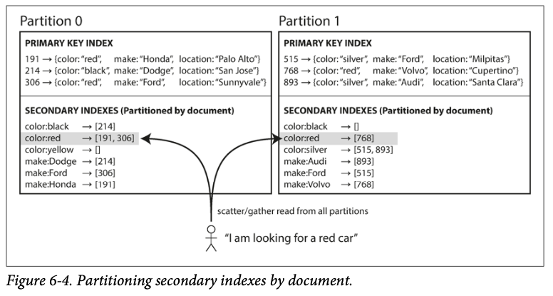
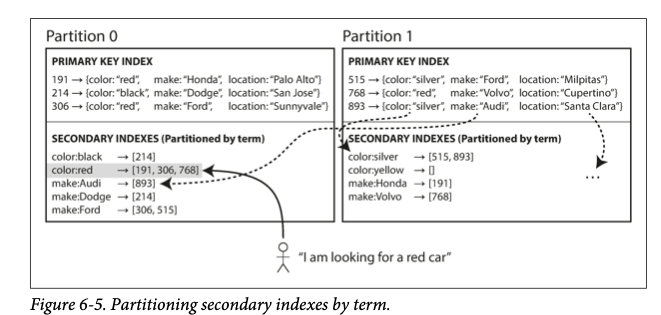

# 第6章 Partitioning

Created: Nov 17, 2020 9:40 PM

Partitioning，也叫 Sharding，是把一份数据分成多份，存储在不同的节点上

Partitioning 需要与 Replication 结合使用，为了防止当一个节点崩溃后，导致数据不完整的情况

当数据被partitioning 后，我们希望数据能均匀分布在所有的节点上。如果数据都被分到同一个节点上，这种情况被称为 skewed。这个节点被称为 hot spot（热点）

## 按键的顺序分配节点

一种把数据分布的算法是按照键的排序来分布。这就跟字典的目录一样。比如在节点 1 上，保存的数据是以 A 到 B 开头的，而节点 12 上的数据是以 T 到 Z 开头的。

- 这种方法的优点是可以对数据进行范围查询。
- 这样的一个问题是，每个节点保存的数据的开头字母的数量可能是不同的，而且如果频繁更新数据后，还需要考虑节点之间的再平衡

## 用哈希函数分配节点

用哈希函数来分配节点，就跟 Java 中的 `HashMap` 相似，不过有一点区别：假设哈希函数返回一个 32 位的二进制数字，假设有 n 个节点，如果哈希值在 0~1/n 之间，那么分配到节点 0；如果在 1/n~2/n 之间，那么分配到节点 1，以此类推。这样做的好处是当再平衡发生时，可以减少一些数据复制

哈希的优点是

- 优点是读取数据的速度接近与 O(1)，并且能实现非常均匀的分布
- 缺点是无法对键做范围查询

为了避免这个缺点，Cassandra 里有一种叫做 compound primary key（组合主键）。这样的主键由几个列构成，第一个列用来做哈希，剩下的列就可以做范围查询了

哈希函数分配方法有一个致命缺点，就是某些超级热点数据（比如说微博里的明星），发布了一个热搜后，数据会集中到一个节点上（因为只对明星的 ID 做哈希）。所以 hot spot 还是不能避免

## 二级索引

二级索引有两种主流的实现方式

- document-based partition
- term-based partition

### Document-based Partition

document-based partition 也被称为 local index。在每个节点上维护各自节点内数据的二级索引，这个各个节点的数据和二级索引与其他节点是独立的。如下图中所示

这种情况下，利用二级索引读取数据就会有些麻烦，因为客户端要去跟所有的节点索要数据，因此这个过程也称为 scatter/gather 

### Term-based Partition

document-based partition 让每个 partition 管理自己的索引，而 term-based partition 则让一个 partition 管理所有其他的 partition 的索引。如果图所示

`color:red` 的索引在 partition 0 上，而 `color:yellow` 的索引在 partition 1 上

term-based partition 的好处是读取效率比较高，客户端只需要读取一个 partition 上的索引；而坏处是写入的效率比较低，因此写入一个 document 后，可能需要更新多个 partition 上的索引。所以这个写入过程需要一个分布式的事务，并不是所有的数据库都支持

## 再平衡

随着时间推移，因为以下原因我们可能需要再平衡（rebalance partition）

- 增加了 CPU
- 增加了磁盘和内存
- 替换了机器

我们希望

- 再平衡后，数据流量应该在各个 partition 之间均匀分布
- 再平衡的过程中，系统应该继续提供读写服务
- 再平衡的过程中，减小不必要的数据复制和转移，以加快再平衡的速度

前面说过，当使用哈希来作为分配节点的依据时，我们要根据 hash-by-range 而不是 hash mod，是因为如果使用 mod 会让当节点数量发生变化时，所有的键都会改到不同的节点

node 和 partition 是两个不同的概念。node 是一个节点，是一个机器；而 partition 是一部分数据集合。partition 的数量小于等于 node 的数量。一个 partition 会被分配到一个 node 上，不会说同一个 partition 内，一部分数据在一个 node 上，另一部分数据在另一个 node 上

当增加了一个 node 后，新增的 node 可以从其他的 node 上“偷”一个 partition 过来，以达到新的 node 上的数据量和其他 node 一致

静态的 partition 分配算法里，partition 的数量是固定不变的。因此当总的数据量越来越大时，partition 也会越来越大。一开始如果 partition 的数量定的太少了，以后就会过大，当 node 数量变化后，需要复制的数据也会很大。如果 partition 的数量太多了，管理起来也会有一些开销。所以在系统开始提供服务时，就需要选择一个不大也不小的数量

动态的 partition 分配算法，当一个 partition 太大了，就一分为二；当 partition 太小了，就与邻近的 partition 合并。HBase 和 MongoDB 就是这样的

在上面的两种算法中，头一个算法里的 partition 的大小与总的数据量成正比；后一个里 partition 的数量与总的数据量成正比。总之他们与 node 的数量无关。因此出现了第三种方法：保持 partition number per node 保持不变。这是 Cassandra 和 Ketama 使用的算法

另外一个需要考虑的问题时，再平衡的过程是自动的还是手动的。全自动的好处是方便，坏处是当一个 node 的负载特别高时，如果另一个 node 决定认为高负载的 node 已经崩溃了，执行再平衡，会让高负载 node 的负载更高。手动的好处是能避免这样的雪上加霜的情况，坏处就是不方便。当然也可以选择一种半自动的算法，算法觉得需要再平衡后通知操作员，让操作员来确认

## 路由

客户端怎么才能知道去哪个 node 读取数据呢？这就是一个服务发现（service discovery）问题。现在有三种方法

1. 客户端随便连接任意 node。如果数据在这个 node 上，node 直接返回数据；否则 node 成为一个代理，向拥有数据的 node 请求数据，得到数据后就返回
2. 做一个代理。客户端连接代理，代理负责向有数据的 node 转发请求
3. 通过某种方法，让客户端知道数据在哪个 node

在上面的三个方法中，都需要让系统中的某一方知道数据是如何分布的，这通常需要一个 coordination service ，比如 ZooKeeper

## Parallel Query Execution

没看懂，讲什么 massively parallel processing（MPP）的