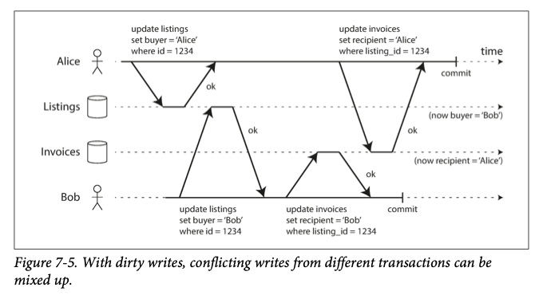
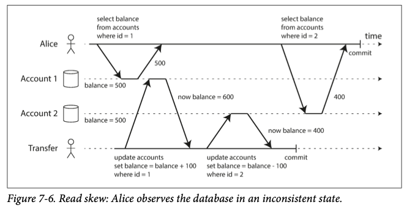

# 第7章 Transaction

### 事务与 ACID

数据库在提供服务的过程中，可能会出现下面这些问题

- 数据库软件和硬件可能随时崩溃
- 客户端可能随时崩溃
- 客户端与数据库之间的网络、数据库的各个节点之间的网络可能随时中断
- 多个客户端同时操作数据库，互相覆盖了对方的数据
- 一个数据可能只被更新了一半
- 多个客户端之间的数据冲突

为了解决这些问题，出现了现在被称为事务（Transaction）的机制。事务简化了客户端的开发

事务提供的四大保证：原子性（Atomicity），一致性（Consistency），隔离型（Isolation），持久性（Durability）。不同的数据库，提供的 ACID 实现可能是不一样的

- 原子性 Atomicity：原子性提供的保证是，客户端在一个事务内执行一系列操作时，这些操作要么全都执行成功，要么全都不成功
- 一致性 Consistency：一致性提供的保证是，数据库在提供服务的期间，对于不变量（invariants）的陈述永远是正确的。不变量是由应用程序来定义的，并且应用程序一定要提供对不变量的正确操作。如果应用程序出错了，数据库也不能纠正错误。准确的说，一致性是对应用程序的要求
- 隔离型 Isolation：隔离型保证，多个并行的事务不会互相影响。
- 持久性 Durability：持久性保证，当事务完成后，事务写入的所有数据一定不会丢失

### 单对象操作（Single-Object Operations）

单对象隔离，是为了防止其他事务看到只更新到一半的单个数据对象。假设要更新 20KB 的一个 JSON 数据，如果没有单对象隔离，可能出现下面这些情况

- 在只传输了前 10KB 数据的情况下网络中断，磁盘上保存了 10KB 的新数据、10KB 的旧数据
- 在更新数据时电源中断，磁盘上保存了一半的新数据、一半的旧数据
- 在更新数据的同时，有另一个事务在读取数据，那么后者可能读取到更新一半的数据

前两种情况是原子性问题，可以通过前面几个章节提到的日志（log）来避免，即先把操作写到日志，然后执行操作；最后一个情况是隔离问题，可以通过在单个对象上加锁来避免

另外，有些数据库可以提供特殊的指令来避免原子性问题。比如提供 increment-and-get 指令来避免 read-modify-write；提供 compare-and-set 指令避免并发问题

### 多对象操作（Multi-Object Operations）

多对象操作指的是在一个事务内操作多个表的数据，包括

- 操作一个表的数据，维护另一表的外键
- 在一个 denormalized 的表中，更新一个表的数据后，需要更新另一个表的所有相关记录的数据
- 在有二级索引的情况下，更新数据后，相关的索引可能也需要更新

### 错误处理

当数据库无法完成它提供的保证时，它就是终止事务执行（abort），让数据库回到正常的状态

当客户端遇到错误后，可以重试事务，但是重试事务也可能遇到下面这些问题

- 如果事务实际上在数据库端执行成功了，但是之后网络中断了，如果客户端重新执行事务，就会导致操作执行了两次
- 如果是因为数据库负载太大导致的事务执行失败，那么重试事务会让情况变得更糟
- 重试事务只有在遇到瞬时错误（transient error）后才有效，比如死锁、网络中断、failover 等；在永久错误（permanent error）后重试是没有意义的，比如违背了约束
- 如果事务对外界有影响（side effects），即使事务终止了，这些外界影响不会终止，比如发送电子邮件。重试事务会导致 side effects 再次发生
- 如果是客户端崩溃了，需要重试的数据已经丢失了

## 事务隔离

事务隔离（Transaction Isolation）是用来处理事务的并发问题的，如果两个事务同时运行，并且其中有一个修改了一部分数据，另一个读取了这个数据，那么就会导致一些奇怪的问题

事务隔离提供的假象是，事务仿佛就是顺序执行的，没有并发。能提供这样的严格的隔离级别就是 Serializable Isolation

如此严格的隔离级别对性能有较大伤害，因此实际上，数据库都会运行于较弱的级别上

### Read Committed

Read Committed 隔离级别提供下面两个保证

- 读取数据时，你只能读取已经 committed 的数据。即没有脏读（no dirty reads）
- 写入数据时，你只能覆盖已经 committed 的数据。即没有脏写（no dirty writes）

第一条是比较好理解的。没有脏读，就意味着一个事务不会读取到另一个原子事务的中间状态

脏写的意思是，一个事务内的写操作，覆盖到了另一个事务的写操作，导致了数据库处于不一致的状态



上面就是一个脏写的例子。有两个事务，都需要更新 Listings 和 Invoices 数据，脏写发生后，Listings 数据的 `buyer` 是 Bob，而 Invoices 数据的 `recipient` 是 Alice

那么要如何实现 Read Committed 呢？

- 对于脏写，要求每个事务在修改一行数据时，必须获得这一行数据的锁。这个锁是 row-level lock。当事务提交或者终止（committed or aborted）后才会释放锁
- 对于脏读，数据库在一行数据被写入时，会记住新的值和旧的值。当有一个事务读取这行数据，且这个事务不是写入的事务，则返回旧值；如果是写入的事务，则返回新值

### Snapshot Isolation，Repeatable Read

上面的 Read Committed 级别，在一些情况下也会出错



上面的情况是，Alice 从 Account 1 转 100 块钱到 Account 2。初始情况下两个 Account 合计是 1000 块钱，但在上面的事务里，Alice 读取到的合计是 900 块钱。当然，当 Alice 再次读取的时候，合计金额又是 1000 块钱了

也就是说，这并不是一个持续性的问题（lasting problem），但是在对数据要求很严苛的情况下，这是个很严重的问题

- 备份。如果后台有一个备份进程在运行，部分进程会读取整个数据库，耗时很长，备份进程就会读取到这样的不一致的状态，即一部分数据保存着新值，另一部分数据保存着旧值
- 分析。分析进程也会遇到读取到一半的数据是新值、另一半是旧值的情况，导致分析得到的结果是错误的

为避免这样的情况，数据库提供了一个程度更高的隔离级别：Snapshot Isolation（国内好像习惯叫它 Repeatable Read）。顾名思义，这个隔离级别在一个事务开始的时候，对数据库做一个快照，以后每次读取数据时，只要本事务没有修改，那么数据的值就是快照的值

如何实现 Snapshot Isolation 呢？数据库使用了一种叫做 MVCC（Multi Version Concurrency Control）的方法。在 PostgreSQL 中，每一个事务都有一个 id （txid），这是一个全局自增的 32 位整数。每一行数据都多保存了两个字段，分别是 `create_by` 和 `delete_by` ，表示哪个事务创建了和删除了这一行数据。被删除的行其实并没有立即从磁盘上抹去，而是保留着，等到没有事务真正清理掉，才被删去。更新一行数据会变成删除和保存

MVCC 实现一个快照的方法如下

1. 事务开始后，记录下这时还在运行的事务 id，这些事务对数据库做出的修改会被本事务忽略，不管后来这些事务有没有提交或者回滚
2. 任何由已回滚的事务造成的修改被忽略
3. 由本事务之后的事务做出的修改，忽略
4. 除上面这些之外，其他修改都可见

简单来说，同时满足下面两个条件的数据，对事务就是可见的

- 在事务开始的时候，已经提交的数据是可见的
- 数据没有被删除，或者被之后的事务删除

另外，Repeatable Read 并没有一个统一的名字。在 Oracle 里这个叫做 serializable，在 PostgreSQL 和 MySQL 里叫 Repeatable Read。Repeatable Read 也没有统一的定义，虽然一些论文给出了正式的定义，但是很多数据库根本不符合这个定义

### Lost Update 问题

接着书上讲了 Lost Update 问题，我不知道这个问题在 Repeatable Read 隔离级别下是不是还存在？

这个问题其实就是当多个客户端尝试修改同一条记录的时候，前一个客户端写入的修改会被后面的客户端覆盖掉，导致了 Lost Update。

客户端修改一行数据，基本都遵循 read-modify-write 循环。因此第一个解决方法就是去掉这个循环，加入了原子操作（Atomic update），如

```sql
update counters set value = value + 1 where id = 123;
```

如果数据库不能提供原子操作，或者客户端因为某些原因不能使用原子操作的话（比如在读取数据、修改数据之后，需要执行客户端代码来验证修改后的数据是否合法，合法之后才能写入），那么就只能使用锁（Lock）

在 SQL 中，可以在 select 语句末尾加入 `for update` 来锁住 select 返回的所有行，直到事务提交了，锁才会被释放

有一些高级的数据库，可以不使用原子操作和加锁，而是让事务并行执行，但是在执行过程中可以检测 Lost Update 的发生，这时就让事务 abort。但是这个特性只有在 PostgreSQL、Oracle、SQL Server 中提供，MySQL 并没有

### Compare-and-set 指令

Compare-and-set 指令（CAS）是另一种防止并发写问题的指令，如下

```sql
update wiki_pages 
set content = 'new content'
   where id = 1 
and content = 'old content';
```

这条 SQL 语句也许能使用到 CAS 指令、也许不能使用到，取决于数据库有没有实现 CAS

### 分布式数据库

在分布式数据库里，在多个节点上能同时修改数据，导致最终的数据产生冲突

锁、CAS 指令只能在一个节点上起作用，因此在多主（multi-leader）、无主（leaderless）系统上，最终无法对数据的一致性达成意见。可行的解决办法是，当冲突发生时，让应用程序来解决冲突并得到结果

如果操作的顺序是可交换（commutative），那么就能在分布式系统上使用原子操作。可交换的操作包括让一个 counter 自增、向一个集合内添加数据，这样的话在一个节点上执行其他节点上的操作就可以了

### 幻读（Phantom Read）和 Write Skew

在 Snapshot Isolation 级别里，可能发生幻读问题

书上的例子，医院有值班医生，医院必须保证任一时刻都有至少一个值班医生，值班医生可以请假。下面是值班医生请假的伪代码

```sql
begin transaction
select count(*) from doctors where on_call = true and shift_id = 1
if (count >= 2) {
	update doctors set on_call = 'false' where name = 'name' and shift_id = 1
}
commit
```

如果一个时刻医院里的值班医生有两个，他们俩都请求下班，然后同时执行上面的代码。因为两者的事务是独立的，所以第一个 `select` 得到的 `count` 值都是 2，两人都会执行下面的 `update` 语句，导致最后医院里没有值班医生了

在这个情形里，解决方法有两个

- 使用更高的隔离级别，比如让事务同一时刻只能执行一个
- 修改第一个语句为 `select * ... for update` ，在返回的结果上加锁

还有一种会发生幻读的情形，在用户注册时，要求用户名不能重复，如果两个人在同一时刻选择使用了同一个用户名，那么两人都会注册成功。这个情况下，可以使用更高的隔离级别，但是使用 `for update` 加锁是不行的，因为值班医生里我们要对数据库做 `update` 操作，需要操作的数据已经在数据库里了，因此可以加锁。但是这里注册用户时，没有数据用来加锁

出现幻读的共同特征

1. 先检查数据库，看条件是否满足
2. 条件满足，决定执行，提交事务

所以这里也是一个 read-modify-write 操作，但是却不能使用原子操作，因为操作的数据涉及到了多个表的数据，或者必须在这两部之间执行一些客户端代码

另外有一种方法叫做 materializing conflicts。它的核心思想是，如果数据库里没有数据让我锁，那么我就人为创建锁。比如在会议室申请的情形里，两个人可能在同时申请了同一个会议室的同一个时间段。如果要使用 materializing conflicts 方法，我们可以创建另一个表，保存了所有的会议室和时间段（每 15 分钟一段）的组合，时间段持续到未来六个月。要租用某个时间段的会议室时，就锁住这个组合

这个方法实现很难实现正确，而且看起来也不是很漂亮。更好的方法就是使用严格线性的隔离级别

## Serializable 隔离级别

Serializable Isolation 是最强最强的隔离级别了，上面所有的问题都可以它来解决

Serializable Isolation 提供了一个保证，在这个隔离级别下，事务仿佛就是一个接着一个执行的，没有并发。实际是否真的没有并发并不重要，但至少从结果上看是这样的

实现这个隔离级别的 3 个方法

- 单线程执行
- Tow-phase-locking
- 乐观并发控制，例如 Serializable Snapshot Isolation（SSI）

这里假设我们的数据库只有一个节点，分布式数据库暂不讨论

### 单线程执行

直到 2007 年，数据库设计者才觉得单线程执行是一个可行的方案，而在这之前，他们觉得多线程执行才能获得比较好的性能。那么为什么现在他们又改变了注意了呢

- 内存条变便宜了，现在可以把数据全都加载到内存里，事务执行变快了
- OLTP（online transaction processing） 的事务都很短，而长时间执行的分析型事务大多都是只读不写的，因此可以只用 snapshot isolation 就行了

在很久以前的老式系统中，在一个事务执行的中间，可能需要用户对查询结果做出一些回应，根据用户的选择接着执行事务。因为用户操作很慢，所以这样的事务要话很长时间才能结束。这样极大地拖慢了整个系统的速度，所以这样的应用程序不能使用单线程的事务

这样的应用程序需要用存储过程（stored procedure），相当于把事务执行的逻辑存在了数据库端

使用存储过程的缺点

- 不同数据库使用不同的语言来定义存储过程
- 存储过程不好管理、不好 debug、不好用 Git 做版本控制、不好部署、不好监控
- 万一有一个存储过程写得不好，会拖累整个数据库

对于上面的第一个问题，目前很多数据库使用通用的语言来定义存储过程，比如 Redis 使用 Lua、VoltDB 使用 Java 和 Groovy 等等

单线程执行事务，如果写入的数据很大，则写入速度严重受限于 CPU 的单核性能。一个解决方法是把数据分区（Partitioning），让每个 CPU 得到一个数据分区，并且让每个事务只读写一个分区上的数据，这样就能并行执行了。但是如果事务需要读取其他分区的数据的话，就需要使用到锁了，这样会严重影响性能

单纯的 KV 键值对数据库可以很方便的分区，但是对于使用了二级索引的数据库，则分区有些困难了

### Two-Phase Locking

Two-Phase Locking 是一个算法，数据库内的每个数据都有一个锁，锁处于 shared mode 或者 exclusive mode，初始情况下锁在shared mode

- 当一个事务要读取数据时，锁必须在 shared mode 才能获取到。当锁在 exclusive mode 时，必须等待锁进入 shared mode 才能获取
- 当一个事务要写入数据时，如果锁在 shared mode，则把锁升级到 exclusive mode，然后获取。如果锁在 exclusive mode，则必须等待锁回到 shared mode 才能升级并获取
- 获取到锁后，事务必须持有锁，直到事务结束才能释放锁

在 Two-Phase Locking 中，如果事务 A 获取了一个锁、并等待事务 B 释放一个锁，同时事务 B 等待事务 A 释放另一个锁，则这时就发生了死锁（deadlock）。数据库能够自动检测到死锁，并会让其中一个事务回滚，然后这个事务需要重试

使用 Two-Phase Locking 后，数据库的性能会极大地下降，因为一个事务可能需要等待其他事务去释放锁

**Predicate Lock** 是满足一些条件的数据的锁，先看下面的语句

```sql
select * from bookings 
where  room_id = 123
  and end_time > '2020-12-01 12:00:00'
and start_time < '2020-12-01 13:00:00'
```

一个事务执行了上面的语句，则会获取上面的条件的 Predicate Lock。当其他事务要修改或写入满足上面的条件的数据，则必须等待前一个事务释放了锁

详细的 Predicate Lock 的规则

- 如果事务 A 执行某一条件的查询，必须获取这一条件的 Predicate Lock。如果另一个事务 B 持有满足条件的某一个数据的 exclusive mode 锁，则事务 A 必须等待 B 释放锁
- 如果事务 A 要插入、更新、删除一个数据，必须先检查数据是否符合某个 Predicate Lock。如果事务 B 持有了一个 Predicate Lock，则 A 要等待 B 释放锁

Predicate Lock 不仅作用于现有的数据，还作用于尚未存在的数据

Predicate Lock 的性能非常低，因为事务必须要检查所有的条件。为了简化这个过程，现在有另一种锁机制叫 **Index-range Locking**。比如在上面的 SQL 语句里，事务直接锁住 `room_id = 123` 的所有数据，或者锁住所有房间的时间在 `start_time` 和 `end_time` 之间的数据

要注意，首先要在这个字段上做好索引，才能高效得锁住数据。如果字段没有做索引，则会锁住整张表

// TODO 未完，先写第八章笔记了，以后补上