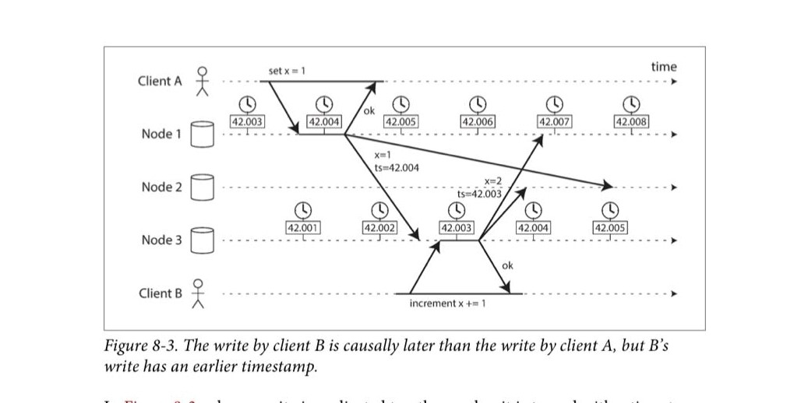
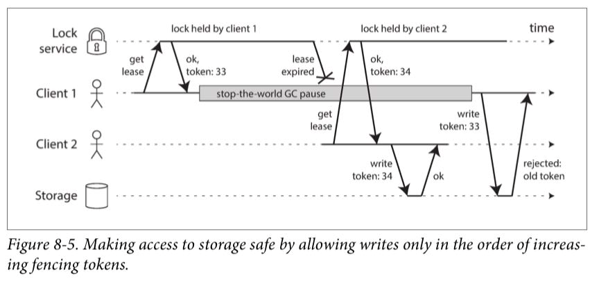

# 第8章 The Trouble with Distributed Systems

墨菲定律：凡是可能出错的事就一定会出错

## 单机与集群

在单机上，硬件故障发生的几率特别小。可能发生的错误有内存比特翻转、硬盘损坏、个别部件的连接线接触不良，这时候整个操作系统就直接蓝屏了。对于单机上的软件也一样，要是遇到了处理不了的错误，直接崩溃是比较好的选择

但是在集群上，各个节点发生故障的概率就变大了。不仅仅是单机可能遇到的错误，还有节点之间的以太网中断、运维错误等等，而且这些错误都是非确定性的（nondeterministic），即有时成功、有时失败。但是当某个节点故障后，你不能让整个集群崩溃，你必须要能够正确处理、让集群继续提供服务

## 云计算与超级计算机的区别

大型系统通常可以分为下面几种

- 超级计算机。由几千个 CPU 组成的计算机，通常进行大型的科学计算，比如天气预报、遗传分析等。这样的计算机有天河二号、Summit 等
- 云计算。云计算没有准确公认的定义，通常是普通的消费级 CPU 组成、多机房、面向企业和普通消费者的服务，机器之间用以太网连接，弹性伸缩，按时计费等等。比如阿里云、AWS 等
- 企业内部网。上面两者之间

超级计算机就像单机一样，如果一部分出错了，那就让整个系统崩溃，不会尝试去恢复

## 在不可靠的世界建造可靠的软件

### 不可靠的网络

如果节点之间使用以太网连接的话，那么网络就一定是不可靠的，甚至在一个机房的机柜之间，也有可能发生连接中断。最重要的是，当网络中断发生的时候，你一定要知道你的应用程序会做出什么样的反应，在测试的时候，你可以故意让你的某个服务器崩溃，以此来测试应用程序（Chaos Monkey）

检测连接中断是非常困难的。应用程序发送一段数据后，可能永远也等不到回应，你可以在应用层重试（TCP 其实在底层也会重试的），如果多次重试都得不到返回，你就可以确定对端崩溃了。不过，即使 TCP 告诉你数据已经传输到对端了，你依然还是无法确定对端正确处理数据了，因为对端可能在处理数据之前就崩溃了。为了能明确地知道对方处理完数据了，对端必须在应用层发送一个回应

检测连接中断的唯一可靠的方法就是心跳。心跳的超时时间不能太长，也不能太短。太短了，会导致很多不必要的 failover，导致一些操作可能会做多次。最坏的情况是，当系统处于极高负载时，节点 A 对心跳的回应因此变慢，Leader 认为 A 崩溃了，把任务重新分配到另一个节点 B，B 的负载变得更高，对心跳的回应也变慢，Leader 会认为 B 崩溃了，如此下去，导致级联崩溃（cascading failure），实际上系统内所有的节点都没崩溃，但是 Leader 缺认为全都崩溃了，集群对外不提供服务了

网络延迟的主要原因有

- 大量的主机正在发送数据，数据帧在交换机内排队
- 接收端的 CPU 忙于处理其他事情
- 在虚拟化环境中，host 的主机暂停了guest 的 CPU
- TCP 的流量控制（congestion avoidance）
- 丢包，导致 TCP 重传

因此心跳的时长最好不要是一个固定值，而是在系统运行过程中通过检测各个节点之间的延迟来决定，这个值甚至可以在运行时时刻变化

### 不可靠的时钟

应用程序大多会使用到时钟，使用时钟的目的有两个：测量时长（duration），确定时间点（points in time）

计算机的时钟是使用叫做 quartz srystal oscillator 的硬件来测量的。不同的机器使用 Network Time Protocol（NTP）协议来校准时钟

现代的计算机上，可以通过接口获取到两种不同的时钟：time-of-day clock 和 monotonic clock

time-of-day clock 代表的是自从 1970-01-01 00:00:00 UTC 以来经历的时间，NTP 协议校准的是这个时钟

monotonic clock 时钟表示的值并没有意义，可能表示自从操作系统启动后经历的时间，他会单调递增，不受 NTP 影响，因此不会向前跳，可以用它来测量时长

普通计算机上的时钟的误差大约是 200ppm（parts per million），一天的话大约有 17 秒的误差

计算机上的时钟与 NTP 服务器的时钟相差过大的话，计算机可能拒绝同步。同步之后，time-of-day clock 可能会向前或者向后跳

注意不要让防火墙挡住了 NTP 流量

使用 NTP 协议后，客户端与服务端的同步不会好于他们之间的网络延迟

leap seconds 可能会让网络瘫痪（不太懂）

虚拟机上的操作系统，因为 host 暂停了虚拟机的执行，恢复的时候会导致虚拟机时钟突然向前跳

如果你的应用程序运行于不属于你的设备上，比如手机，那么你不能依赖于设备的时钟，因为用户可能会修改时钟

如果想让机器的时钟完全准确，可以使用 GPS 接收器和 Precision Time Protocol（PTP），不懂是什么原理

在分布式系统中，如果有两个节点的时钟相差太大，可能会导致对事件的排序发生错误。例如下图中节点1 和节点3 的时钟相差不到 3ms，他们分别修改了 x 的值后，将最新值发送到节点2 上，节点2 错误地把 x 设置为了 1

这个系统中使用的冲突解决算法是 last write wins（LWW），在多主和无主系统中使用较多。即使在客户端上生成修改的时间戳，也不能解决一些问题

- 在节点上的一些数据可能会因为时间不同步而神秘地消失
- 在上图的情况中，节点3 上的修改其实是顺序的，因为 `increment x` 指令必须要在节点1 上的 `set` 指令之后执行；而 `set` 指令是并发的，因为无论 x 是否存在， `set` 都能正确执行。LWW 无法分清这两者的顺序。这里可能需要使用到 version vector 技术
- 当时间戳的只精确到毫秒时，可能会有两个指令的时间戳相等，这时就需要另外一种解决冲突的办法了

解决这些问题的一个可行的方案，就是使用逻辑时钟（logical clocks），比如 log sequence number

计算机的时钟给你返回的时钟不是精确的，而是比如说有 95% 的概率现在的时间在 10.3 秒和 10.5 秒之间。大多数计算机不会告诉你这个返回，但是 Google 的 Spanner 系统有一个叫做 TrueTime 的 API，调用他后返回两个值 `[earliest, latest]` ，即最早和最迟的值

在前一个章节里讲过的 Snapshot Isolation 里，每个事务必须要有一个 Transaction ID，较小的事务不能读取较大的事务写入的值。在单机数据库里，这个 ID 可以用一个递增的计数器实现，但是在分布式系统里如何实现呢？首先不能使用 Twitter 的 Snowflake 算法，原因没看懂。在 Google 的 Spanner 系统里，如果有两个事务 A 和 B，用 TrueTime API 获取了两个时间戳 `[A_e, A_l]` 和 `[B_e, B_l]` ，如果这两个时间戳不重叠，那么这两个事务肯定有确定的先后关系，靠前的事务读取不到靠后的事务的写入值。那要如何保证 A 和 B 的时间戳不重叠呢？在事务提交的时候，Spanner 会故意等待一段时间，才会提交，使得时间戳不重叠。这个等待的时间越小越好，Google 在每个 Spanner 的机房都放置了 GPS 接收器，保证所有机器的时钟相差不到 7ms

### 进程暂停

在编写分布式系统代码时，要时刻记住应用程序可能会随时被暂停，而且暂停的时长也不能确定。导致暂停的时间有

- 垃圾回收
- 一些虚拟机平台提供的 live migration 功能，即在不关机的情况下把一台正在运行的虚拟机转移到另一台机器上，这通常通过保存虚拟机内存里的内容、然后复制到另一台主机上实现
- 如果应用程序运行在笔记本电脑上，然后用户合上了盖子
- host 机器暂停一个虚拟机，然后运行另一个虚拟机
- 磁盘 IO
- 内存交换
- 应用程序收到 `SIGSTOP` 指令就会暂停，收到 `SIGCONT` 指令恢复执行

### 实时系统

如果要求请求在指定的时间内必须返回的话，我们就会要求使用到实时系统（real time operating system）。这些系统包括在航空飞机上的系统等。但是实时系统的花费会更高，因此分布式系统通常不会使用

### 减小 GC 的影响

减小 GC 的影响，有下面几种方法

- 语言提供一个 hook，当 GC 即将发生的时候通知应用程序，让这个节点不再接受新的请求，直到 GC 结束
- 正常进行 minor GC，因为耗时较短。不再进行 full GC，而是要 full GC 时直接重启进程

## 真相与谎言

### Fencing token

在下图中，Client 1 申请到 token 后发生了一次 GC，在这期间 token 失效；而 Client 2 同时申请到了新的 token，为了避免有两个 Client 发生并发读写，Storage 在接受 Client 的写请求时，需要对 token 进行验证，这就叫 fencing token 技术

### 拜占庭问题

拜占庭问题，即在分布式系统中，存在某些节点是恶意攻击者的情况，攻击者可能会发出恶意请求、对请求发出错误的回应，达到破坏系统的目的

彻底解决拜占庭问题特别难，需要付出很大的代价，而且因为绝大多数的分布式系统都运行于企业内部机房，因此可以认为不存在恶意攻击者，因此绝大多数的分布式系统都不去处理它。但是如果系统会运行与不受控制的机器，比如比特币可以运行于任何人的机器上，这时就必须处理它

但是无论如何，弱类型的拜占庭问题还是存在的，比如电磁辐射导致内存中的比特翻转、网络中的比特反转、bug 都可能导致错误的信息发出。因此对于接收到的所有数据，应用程序必须要做参数检查